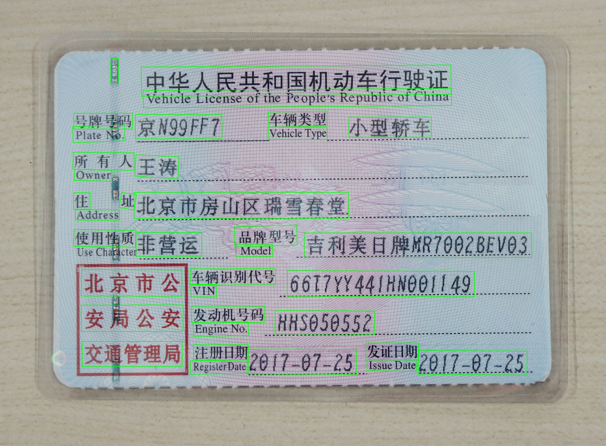

# mica-ppocr（Java 图片 OCR 识别）

[](https://github.com/lets-mica/mica-ppocr/actions/workflows/test-and-build.yml)

[](https://central.sonatype.com/artifact/net.dreamlu/mica-ppocr-core/versions)

> PP-OCRv6 文字检测 + 识别的 **Java 17** 实现，纯 ONNX Runtime 推理，
> **零 PaddlePaddle 依赖**。完整复现预处理 / 后处理（DB 后处理、CTC 解码、
> pyclipper 等价的多边形 unclip）。

移植自 [`AIwork4me/ppocrv6_onnx`](https://github.com/AIwork4me/ppocrv6_onnx) 的 `ppocrv6_onnx.py` 单文件参考实现，**与 Python 版本保持 bit-exact**（默认 CPU 单线程）。

---

## 1. 环境要求

| 组件 | 版本 | 说明 |
|------|------|------|
| JDK | 17+ | 推荐 Azul Zulu 17 / Temurin 17 / Oracle 17 |
| Maven | 3.6+ | 编译 / 打包 |
| ONNX Runtime | 1.26.0 | 由 Maven 自动拉取 |
| OpenCV | 4.10.0-0 | 由 Maven 自动拉取（含 Windows/Linux/macOS 原生库） |
| JTS | 1.20.0 | 多边形偏移（pyclipper 等价物） |

## 2. 模型目录

已经下载了 PP-OCRv6 官方 ONNX 模型（det + rec），放到 `models/ppocr-v6/{tier}/` 目录，可以按需选择：

```lua
models/ppocr-v6/
├── tiny/        # 轻量，速度快，精度一般 (det 1.7MB + rec 4.3MB)
│   ├── det.onnx
│   ├── rec.onnx
│   └── dict.txt
├── small/       # 平衡档 (det 9.4MB + rec 20.2MB)
│   ├── det.onnx
│   ├── rec.onnx
│   └── dict.txt
└── medium/      # 高精度档 (det 59.2MB + rec 73.0MB)
    ├── det.onnx.zip # 由于 git 限制，需要解压后使用
    ├── rec.onnx.zip # 由于 git 限制，需要解压后使用
    └── dict.txt
```

### 2.1 模型选择

| 档次 | det 模型 | rec 模型 | 字符表 | 定位 |
|------|----------|----------|--------|------|
| `tiny` | 1.7 MB | 4.3 MB | 约 2855 字符 | 轻量优先，速度快，精度一般 |
| `small` | 9.4 MB | 20.2 MB | 约 2855 字符 | 速度与精度均衡，推荐默认 |
| `medium` | 59.2 MB | 73.0 MB | 约 7180 字符 | 精度优先，覆盖更全字符集 |

### 2.2 模型场景

| 场景 | 推荐档次 | 说明 |
|------|---------|------|
| 移动端 / 嵌入式设备 | `tiny` | 模型体积小、内存占用低，适合资源受限环境 |
| 实时视频流 / 高并发调用 | `tiny` | 推理延迟低，吞吐高 |
| 通用文档识别、日常开发调试 | `small` | 各项指标均衡，覆盖大多数场景 |
| 服务器端批量识别 | `small` | 速度与精度兼顾，推荐默认 |
| 复杂版面 / 低质量图片 | `medium` | 检测与识别精度最高 |
| 生僻字及全字符集场景 | `medium` | 字符表约 7180 个，覆盖面更广 |

### 2.4 模型评分


## 3. 本地 main 测试

[mica-ppocr-core/src/test/java/net/dreamlu/mica/ai/ppocr/test/Main.java](mica-ppocr-core/src/test/java/net/dreamlu/mica/ai/ppocr/test/Main.java) 是一个**写死路径的本地测试入口**，直接运行即可对一张图片做 OCR 推理，便于快速验证。

```bash
mvn -pl mica-ppocr-core test-compile
mvn -pl mica-ppocr-core exec:java -Dexec.mainClass=net.dreamlu.mica.ai.ppocr.test.Main
# 或在 IDE 中直接 Run 'Main'
```

源码中三个常量按需修改：

```java
private static final String TIER      = "tiny";                 // tiny / small / medium
private static final String IMAGE_PATH = "test_images/1.png";   // 待推理图片
private static final String VIS_PATH  = "test_images/vis.png";  // 可视化结果；传 null 跳过
```

### 3.1 识别效果示例

以 `test_images/1.png` 为例（模型档次 `tiny`），识别结果可视化如下：

| 输入图片 | 识别结果可视化 |
|---------|---------------|
|  |  |

注意：测试的行驶证来源于网络，如有侵权，请联系删除。

**识别结果：**

```text
--- 行驶证结构化解析 ---
plateNo:      鲁GH9P12
owner:        盛瑞传动股份有限公司
vehicleType:  小型普通客车
vin:          LJ8F3D5H910700001
issueDate: 2018-02-24
```

注意：识别结果结构化采用`标签定位 + 位置匹配 + 正则兜底`的四步法，可以参考 [VehicleLicenseParser](mica-ppocr-core/src/test/java/net/dreamlu/mica/ai/ppocr/test/VehicleLicenseParser.java) 

## 4. 使用

引入依赖：

```xml
<dependency>
    <groupId>net.dreamlu.mica.ai</groupId>
    <artifactId>mica-ppocr-core</artifactId>
    <version>${mica.ppocr.version}</version>
</dependency>
```

核心 API：`net.dreamlu.mica.ai.ppocr.engine.PPOcrV6Engine`，实现 `Closeable`，推荐 try-with-resources。

```java
import net.dreamlu.mica.ai.ppocr.config.PPOcrV6Config;
import net.dreamlu.mica.ai.ppocr.config.PPOcrV6Result;
import net.dreamlu.mica.ai.ppocr.engine.PPOcrV6Engine;
import net.dreamlu.mica.ai.ppocr.utils.OrtProviders;
import org.opencv.core.Mat;
import org.opencv.imgcodecs.Imgcodecs;
import nu.pattern.OpenCV;

import java.util.List;

public class Demo {
    public static void main(String[] args) {
        OpenCV.loadLocally();
        Mat img = Imgcodecs.imread("test.png");
        PPOcrV6Config config = PPOcrV6Config.builder()
            .detModelPath("models/ppocr-v6/tiny/det.onnx")
            .recModelPath("models/ppocr-v6/tiny/rec.onnx")
            .recCharDictPath("models/ppocr-v6/tiny/dict.txt")
            .build();
        try (PPOcrV6Engine engine = new PPOcrV6Engine(config)) {
            List<PPOcrV6Result> results = engine.run(img);
            for (PPOcrV6Result r : results) {
                System.out.printf("%s  (%.3f)%n", r.text(), r.score());
            }
        }
    }
}
```

支持更多调参（DB 阈值、识别批大小、ORT 线程数、GPU 加速等），详见 [PPOcrV6Config.java](mica-ppocr-core/src/main/java/net/dreamlu/mica/ai/ppocr/config/PPOcrV6Config.java)。

## 5. Spring Boot Starter

引入依赖：

```xml
<dependency>
    <groupId>net.dreamlu.mica.ai</groupId>
    <artifactId>mica-ppocr-spring-boot-starter</artifactId>
    <version>${mica.ppocr.version}</version>
</dependency>
```

`application.yml`：

```yaml
mica:
  ai:
    ppocr:
      enabled: true                       # 设为 false 关闭 Starter
      det-model-path: models/ppocr-v6/tiny/det.onnx
      rec-model-path: models/ppocr-v6/tiny/rec.onnx
      rec-char-dict-path: models/ppocr-v6/tiny/dict.txt
      # 其它可选：det-thresh / det-box-thresh / det-unclip-ratio /
      #         rec-batch-size / prefer-accelerator / intra-op-num-threads / ...
```

注入引擎即可使用：

```java
@Service
public class OcrService {
    private final PPOcrV6Engine engine;
    public OcrService(PPOcrV6Engine engine) { this.engine = engine; }

    public List<PPOcrV6Result> recognize(Mat image) {
        return engine.run(image);
    }
}
```

### 4.1 PPOCRPropertiesCustomizer

业务方可在 `mica.ai.ppocr` 之外对配置做旁路覆盖（环境变量 / 配置中心 / 路径解析等）：

```java
@Component
public class TierCustomizer implements PPOCRPropertiesCustomizer {
    @Override
    public void customize(PPOcrV6Config.PPOcrV6ConfigBuilder builder) {
        String tier = System.getenv("PPOCR_TIER");
        if ("small".equals(tier)) {
            builder.detModelPath("models/ppocr-v6/small/det.onnx")
                   .recModelPath("models/ppocr-v6/small/rec.onnx")
                   .recCharDictPath("models/ppocr-v6/small/dict.txt");
        }
    }
}
```

或函数式风格：

```java
@Bean
PPOCRPropertiesCustomizer tierEnvCustomizer() {
    return builder -> {
        String tier = System.getenv("PPOCR_TIER");
        if (tier != null) {
            builder.detModelPath("models/ppocr-v6/" + tier + "/det.onnx")
                   .recModelPath("models/ppocr-v6/" + tier + "/rec.onnx")
                   .recCharDictPath("models/ppocr-v6/" + tier + "/dict.txt");
        }
    };
}
```

Customizer 按 Spring 容器顺序生效；多个时建议用 `@Order` 显式控制。

## 6. 项目结构

```
mica-ppocr/                                       # 父 pom（packaging=pom）
├── pom.xml
├── README.md
├── CLAUDE.md
├── models/ppocr-v6/{tiny,small,medium}/          # 自备模型（不在仓库中）
├── mica-ppocr-core/
│   └── src/main/java/net/dreamlu/mica/ai/ppocr/
│       ├── engine/PPOcrV6Engine.java             # 唯一公开入口（Closeable）
│       ├── config/PPOcrV6Config.java             # Lombok @Builder 配置
│       ├── config/PPOcrV6Result.java             # record (text, score, box)
│       ├── preprocessor/DetectionPreprocessor.java
│       ├── preprocessor/RecognitionPreprocessor.java
│       ├── postprocessor/DbPostProcessor.java
│       ├── postprocessor/CtcLabelDecoder.java
│       └── utils/
│           ├── BoxUtil.java                      # 框排序 + minAreaRect
│           ├── CropUtil.java                     # 透视裁剪
│           ├── Offset.java                       # JTS BufferOp（pyclipper 等价）
│           ├── NdArrayUtils.java                 # numpy 风格轻量子集
│           └── OrtProviders.java                 # ORT 执行提供者选择
│       └── cli/Main.java                         # CLI 入口
└── mica-ppocr-spring-boot-starter/
    └── src/main/java/net/dreamlu/mica/ai/ppocr/autoconfigure/
        ├── PPOCRAutoConfiguration.java
        ├── PPOCRProperties.java                  # @ConfigurationProperties("mica.ai.ppocr")
        ├── PPOCRPropertiesCustomizer.java        # 旁路覆盖 SPI
        └── OpenCVNativeLoader.java
```

## 6. 许可证

Apache License Version 2.0
