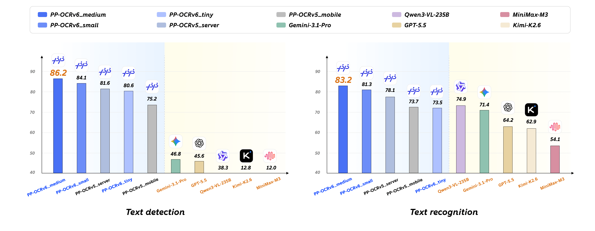
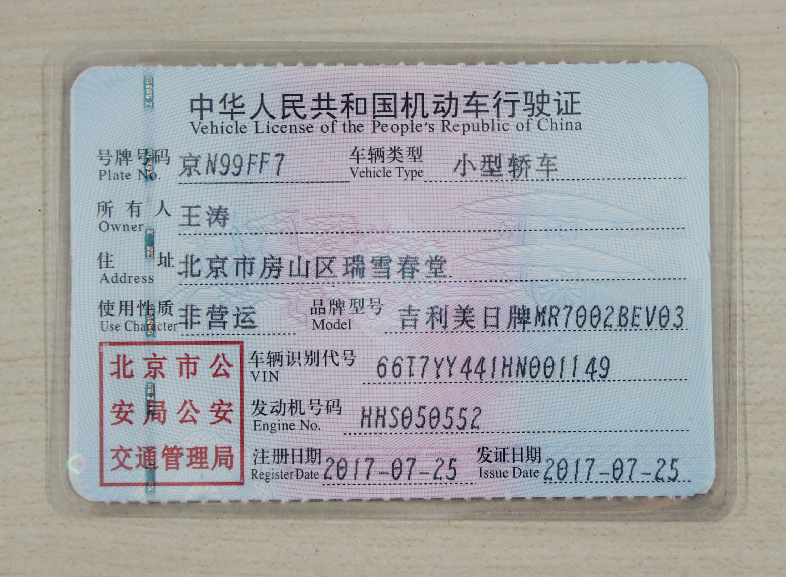
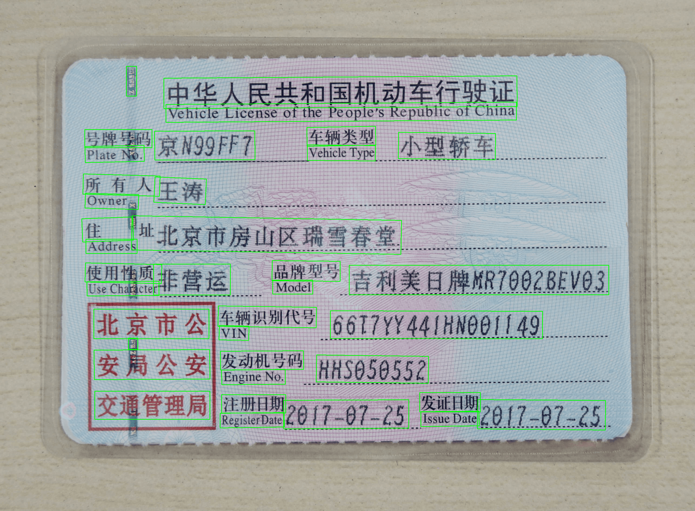

# mica-ppocr（Java 图片 OCR 识别）

[](https://github.com/lets-mica/mica-ppocr/actions/workflows/test-and-build.yml)

[](https://central.sonatype.com/artifact/net.dreamlu/mica-ppocr-core/versions)


> PP-OCRv6 文字检测 + 识别的 **Java 17** 实现，纯 ONNX Runtime 推理，
> **零 PaddlePaddle 依赖**。完整复现预处理 / 后处理（DB 后处理、CTC 解码、
> pyclipper 等价的多边形 unclip）。

移植自 [`AIwork4me/ppocrv6_onnx`](https://github.com/AIwork4me/ppocrv6_onnx) 的 `ppocrv6_onnx.py` 单文件参考实现，**与 Python 版本保持 bit-exact**（默认 CPU 单线程）。

---

## 1. 环境要求

| 组件 | 版本 | 说明                        |
|------|------|---------------------------|
| JDK | 17+ | java 环境                   |
| ONNX Runtime | 1.18.0 | 此版本内置的原生库可兼容更多操作系统版本      |
| OpenCV | 4.10.0-0 | 含 Windows/Linux/macOS 原生库 |
| JTS | 1.20.0 | 多边形偏移（pyclipper 等价物）      |

## 2. 模型目录

下载 PP-OCRv6 官方 ONNX 模型（det + rec），放到 `models/ppocr-v6/{tier}/` 目录：

| 档次 | det 模型 | rec 模型 | 字符表 | 定位 |
|------|----------|----------|--------|------|
| `tiny` | 1.7 MB | 4.3 MB | 约 2855 字符 | 轻量优先，速度快，精度一般 |
| `small` | 9.4 MB | 20.2 MB | 约 2855 字符 | 速度与精度均衡，推荐默认 |
| `medium` | 59.2 MB | 73.0 MB | 约 7180 字符 | 精度优先，覆盖更全字符集 |

> `medium` 的 det/rec 模型为 `.onnx.zip`，需解压后使用。

**可选**：文档方向分类模型（`PP-LCNet_x1_0_doc_ori` 的 ONNX 导出，6.47 MB），放在 `models/ppocr-v6/doc_ori/doc_ori.onnx`。
启用后会在检测前对整图方向做 4 分类（0°/90°/180°/270°）并自动旋转到正向，避免用户侧倒拍/横拍导致识别失败；CPU 单张图多 ~3 ms。详见 [§4.3 文档方向分类](#43-文档方向分类-pp-ocrv6-use_doc_orientation_classify)



## 3. 本地 main 测试

每个解析器都提供了对应的 `XxxMain` 调试入口（如行驶证 [VehicleLicenseMain](mica-ppocr-structured/src/test/java/net/dreamlu/mica/ai/ppocr/structured/parser/vehicle/VehicleLicenseMain.java)），**直接运行 main 方法**即可做 OCR 推理 + 结构化解析。

各 `XxxMain` 源码中修改图片路径即可切换测试图片：

```java
private static final String TIER       = "tiny";                              // tiny / small / medium
private static final String IMAGE_PATH = "test_images/vehicle/vehicle1.png";  // 待推理图片
private static final String VIS_PATH   = "test_images/vehicle/vis.png";       // 可视化输出；传 null 跳过
```

### 3.1 识别效果示例

以 `test_images/vehicle/vehicle1.png` 为例（模型档次 `tiny`）：

| 输入图片 | 识别结果可视化 |
|---------|---------------|
|  |  |

```text
--- 行驶证结构化解析 ---
plateNo:      鲁GH9P12
owner:        盛瑞传动股份有限公司
vehicleType:  小型普通客车
vin:          LJ8F3D5H910700001
issueDate:    2018-02-24
```

注意：测试的行驶证来源于网络，如有侵权，请联系删除。

## 4. 核心引擎使用（mica-ppocr-core）

引入依赖：

```xml
<dependency>
    <groupId>net.dreamlu</groupId>
    <artifactId>mica-ppocr-core</artifactId>
    <version>${mica.ppocr.version}</version>
</dependency>
```

核心 API：`net.dreamlu.mica.ai.ppocr.engine.PPOcrV6Engine`，实现 `Closeable`，推荐 try-with-resources。

公开入口 **只暴露 `String` / `File` / `byte[]`** 三种入参，内部自动完成 OpenCV Mat 的解码与 release，调用方**无需关心 native 内存**：

```java
import net.dreamlu.mica.ai.ppocr.config.PPOcrV6Config;
import net.dreamlu.mica.ai.ppocr.engine.PPOcrV6Result;
import net.dreamlu.mica.ai.ppocr.engine.PPOcrV6Engine;
import nu.pattern.OpenCV;

import java.util.List;

public class Demo {
    public static void main(String[] args) {
        OpenCV.loadLocally();
        PPOcrV6Config config = PPOcrV6Config.builder()
            .detModelPath("models/ppocr-v6/tiny/det.onnx")
            .recModelPath("models/ppocr-v6/tiny/rec.onnx")
            .recCharDictPath("models/ppocr-v6/tiny/dict.txt")
            .useDocOrientationClassify(true)                                  // 是否启用整图 4 方向分类 + 自动旋转
            .docOrientationModelPath("models/ppocr-v6/doc_ori/doc_ori.onnx")  // 开启后必填
            .docOrientationThresh(0.3f)                                       // 置信度阈值，< 此值视为 0°；默认 0.3
            .build();
        try (PPOcrV6Engine engine = new PPOcrV6Engine(config)) {
            // ① 推荐：直接传文件路径
            List<PPOcrV6Result> results = engine.run("test_images/vehicle/vehicle1.png");
            for (PPOcrV6Result r : results) {
                System.out.printf("%s  (%.3f)%n", r.text(), r.score());
            }
            // ② 也支持 engine.run(new File("test.png")) / engine.run(multipartFile.getBytes())
        }
    }
}
```

Engine 公开 API（每个方法 4 种入参）：

| 方法组 | 入参 1 `String` | 入参 2 `File` | 入参 3 `Path` | 入参 4 `byte[]` | 说明 |
|--------|-----------------|---------------|---------------|-----------------|------|
| `run(...)` | `run(String imagePath)` | `run(File imageFile)` | `run(Path imagePath)` | `run(byte[] imgBytes)` | 完整 OCR（检测+排序+裁剪+识别） |
| `detect(...)` | `detect(String imagePath)` | `detect(File imageFile)` | `detect(Path imagePath)` | `detect(byte[] imgBytes)` | 仅检测（返回 boxes+scores） |

> - `Path` 重载兼容非默认文件系统（如 ZIP / JIMFS / 内存 FS）：优先走 native 文件读取，不支持的 FileSystem 自动退回 `Files.readAllBytes`。
> - 确需复用已加载 Mat 的高级场景（如同一图跑多次推理），可使用 `runMat(Mat)` / `detectMat(Mat)` / `recognizeMat(List<Mat>)`（Mat 的 release 由调用方负责）。

支持更多调参（DB 阈值、识别批大小、ORT 线程数、GPU 加速等），详见 [PPOcrV6Config.java](mica-ppocr-core/src/main/java/net/dreamlu/mica/ai/ppocr/config/PPOcrV6Config.java)。

### 4.3 文档方向分类（PP-OCRv6 use_doc_orientation_classify）

对齐 PP-OCRv6 官方 PaddleOCR 3.7+ 的 `use_doc_orientation_classify` 开关，使用 `PP-LCNet_x1_0_doc_ori`（4 类：0°/90°/180°/270°）在检测前对整图做方向校正，避免用户侧倒拍/横拍导致识别失败。

**模型**：6.47 MB ONNX，shape = `[1, 3, 224, 224]`，输出 `[1, 4]`（softmax + argmax）。可从 [ModelScope `farming789/pp-lcnet-doc-ori`](https://www.modelscope.cn/models/farming789/pp-lcnet-doc-ori) 直接下载 `model.onnx`，零 Paddle 依赖。

**性能与代价**：
- CPU：单图多 ~3 ms（极小）
- 内存：多 ~30 MB（加载第三个 ONNX session）
- 行为：默认关闭（`useDocOrientationClassify=false`），与原版完全 bit-exact，不影响现有调用

## 5. 结构化解析（mica-ppocr-structured）

引入依赖：

```xml
<dependency>
    <groupId>net.dreamlu</groupId>
    <artifactId>mica-ppocr-structured</artifactId>
    <version>${mica.ppocr.version}</version>
</dependency>
```

已实现的解析器：

| 解析器 | 解析类名 | 支持字段 |
|--------|----------|---------|
| 行驶证 | `VehicleLicenseParser` | 号牌号码、所有人、车辆类型、VIN、发证日期 |
| 身份证（正反面自动判定） | `IdCardParser` | 姓名、性别、民族、出生日期、住址、公民身份号码、签发机关、有效期限 |
| 银行卡 | `BankCardParser` | 卡号、有效期、银行名称 |
| 机动车驾驶证 | `DriverLicenseParser` | 证号、姓名、性别、国籍、住址、出生日期、初次领证日期、准驾车型、签发机关、有效期限 |

所有结构化结果统一继承 [`BaseStructuredResult`](mica-ppocr-structured/src/main/java/net/dreamlu/mica/ai/ppocr/structured/parser/core/BaseStructuredResult.java)，带两个**可视化友好的通用字段**：

| 字段 | 类型 | 说明 |
|------|------|------|
| `rawResults` | `List<PPOcrV6Result>` | 完整原始 OCR 结果（含每个文字框的文本/置信度/四角坐标），可直接在页面上绘制全部文字框 |
| `fieldBoxes` | `Map<String, List<int[][]>>` | 字段名 → 该字段对应的 OCR 框坐标列表（一个字段可能跨多个框），方便高亮"这个字段来自画面哪几块" |

> 行驶证解析器已完整填充 `fieldBoxes`（车牌/车主/车型/VIN/发证日期 共 5 个字段）。其他解析器目前保证 `rawResults` 填充，`fieldBoxes` 逐步完善；未填充时可通过 `rawResults` 自行按文本内容做二次匹配。

通用能力下沉到 [`LabelMatcher`](mica-ppocr-structured/src/main/java/net/dreamlu/mica/ai/ppocr/structured/parser/core/LabelMatcher.java)：标签定位 + 位置匹配 + 正则兜底 + 版面布局兜底，并提供 `WithBox` 系列重载（返回 `LabeledMatch(value, box)`，便于解析器回填 `fieldBoxes`）。调用示例（行驶证）：

```java
import net.dreamlu.mica.ai.ppocr.engine.PPOcrV6Result;
import net.dreamlu.mica.ai.ppocr.structured.parser.vehicle.VehicleLicenseParser;

import java.util.List;

public class Demo {
    public static void main(String[] args) {
        List<PPOcrV6Result> ocrResults; // 来自 PPOcrV6Engine.run(...)
        VehicleLicenseResult license = VehicleLicenseParser.parse(ocrResults);
        System.out.println("车牌: " + license.getPlateNo());
        System.out.println("VIN:  " + license.getVin());
    }
}
```

> Spring 场景下推荐直接使用 [`PPOcrTemplate`](#6-spring-boot-starter)，无需手动注册 parser bean。

## 6. Spring Boot Starter

引入依赖：

```xml
<dependency>
    <groupId>net.dreamlu</groupId>
    <artifactId>mica-ppocr-spring-boot-starter</artifactId>
    <version>${mica.ppocr.version}</version>
</dependency>
```

`application.yml`：

```yaml
mica:
  ai:
    ppocr:
      # ===== 开关：设为 false 时整个 Starter 不注入任何 Bean =====
      # enabled: true                                         # 默认 true
      # ===== 必填：三个模型文件路径 =====
      det-model-path: models/ppocr-v6/tiny/det.onnx          # 检测模型
      rec-model-path: models/ppocr-v6/tiny/rec.onnx          # 识别模型
      rec-char-dict-path: models/ppocr-v6/tiny/dict.txt      # 识别字符字典
      # ===== 检测（DB 后处理）参数 =====
      # det-limit-side-len: 64                                # 检测图像短边限制
      # det-limit-type: min                                   # 限制类型：min / max
      # det-max-side-limit: 4000                              # 检测最大边长限制
      # det-thresh: 0.3                                       # 检测像素阈值
      # det-box-thresh: 0.6                                   # 检测框阈值
      # det-unclip-ratio: 1.5                                 # 多边形 unclip 比例
      # ===== 识别参数 =====
      # rec-image-shape: [3, 48, 320]                         # 识别输入 shape [C, H, W]
      # rec-batch-size: 6                                     # 识别批处理大小
      # ===== 可选：文档方向分类（PP-LCNet_x1_0_doc_ori）=====
      # use-doc-orientation-classify: false                   # 是否启用整图 4 方向分类 + 自动旋转
      # doc-orientation-model-path: models/ppocr-v6/doc_ori/doc_ori.onnx  # 启用时必填
      # doc-orientation-thresh: 0.3                           # 置信度阈值 < 此值视为 0°；实测 0.3 比 0.5 更稳
      # ===== 性能 / 运行模式 =====
      # prefer-accelerator: false                             # 是否优先 GPU（默认 false 强制 CPU，保证 bit-exact）
      # intra-op-num-threads: 1                               # ONNX 内部线程数
      # inter-op-num-threads: 1                               # ONNX 交互线程数
```

直接注入 `PPOcrTemplate` 即可使用（内部持有 Engine 与 4 个证件解析器，无需手工装配）：

`PPOcrTemplate` API（**每个方法提供 5 种入参重载**：`String` 路径 / `File` / `Path` / `byte[]` / `InputStream`）：

| 方法（× 5 种入参） | 返回类型 | 说明 |
|-------------------|----------|------|
| `run(...)` | `List<PPOcrV6Result>` | 纯 OCR 识别 |
| `parse(..., parser)` | `R` | 通用结构化解析（支持自定义解析器） |
| `parseVehicleLicense(...)` | `VehicleLicenseResult` | 行驶证 |
| `parseIdCard(...)` | `IdCardResult` | 身份证（正反面自动判定） |
| `parseBankCard(...)` | `BankCardResult` | 银行卡 |
| `parseDriverLicense(...)` | `DriverLicenseResult` | 驾驶证 |

> - 内部自动处理 OpenCV Mat 解码与 release，**调用方完全不需要关心 native 内存管理**。
> - `Path` 重载兼容 ZIP / JIMFS / 内存 FS 等非默认文件系统。

注入即用：

```java
import net.dreamlu.mica.ai.ppocr.autoconfigure.PPOcrTemplate;
import org.springframework.beans.factory.annotation.Autowired;
import org.springframework.stereotype.Service;
import org.springframework.web.multipart.MultipartFile;

import java.io.File;
import java.io.IOException;
import java.io.InputStream;
import java.net.URL;

@Service
public class OcrService {
    @Autowired
    private PPOcrTemplate ppocr;

    // ① Spring Boot 上传（最常用）
    public VehicleLicenseResult recognizeVehicle(MultipartFile file) throws IOException {
        return ppocr.parseVehicleLicense(file.getBytes());
    }

    // ② 本地上传文件路径
    public IdCardResult recognizeIdCard(String imagePath) {
        return ppocr.parseIdCard(imagePath);
    }

    // ③ File 对象
    public BankCardResult recognizeBankCard(File imageFile) {
        return ppocr.parseBankCard(imageFile);
    }

    // ④ 网络流 / S3 下载流
    public DriverLicenseResult recognizeDriver(URL url) throws IOException {
        try (InputStream in = url.openStream()) {
            return ppocr.parseDriverLicense(in);
        }
    }

    // ⑤ 自定义解析器场景（任何入参都支持）
    public <R> R recognize(String imagePath, BaseStructuredParser<R> parser) {
        return ppocr.parse(imagePath, parser);
    }
}
```

**结构化结果可视化示例**（利用 `rawResults` + `fieldBoxes`）：

```java
VehicleLicenseResult r = ppocr.parseVehicleLicense(file.getBytes());

// 画所有文字框（绿线）
for (PPOcrV6Result ocr : r.getRawResults()) {
    drawPolyline(ocr.box(), Color.GREEN);
}
// 高亮车牌字段（红线）
List<int[][]> plateBoxes = r.getFieldBoxes().get("plateNo");
if (plateBoxes != null) {
    for (int[][] box : plateBoxes) drawPolyline(box, Color.RED);
}
```

业务方可通过 `PPOCRPropertiesCustomizer` 对配置做旁路覆盖（环境变量 / 配置中心等）：

```java
@Bean
PPOCRPropertiesCustomizer tierEnvCustomizer() {
    return builder -> {
        String tier = System.getenv("PPOCR_TIER");
        if (tier != null) {
            builder.detModelPath("models/ppocr-v6/" + tier + "/det.onnx")
                   .recModelPath("models/ppocr-v6/" + tier + "/rec.onnx")
                   .recCharDictPath("models/ppocr-v6/" + tier + "/dict.txt");
        }
    };
}
```

## 7. 项目结构

```
mica-ppocr/                                       # 父 pom（packaging=pom）
├── mica-ppocr-core/                              # 核心引擎，零 Spring 依赖
│   └── engine/PPOcrV6Engine.java                 # 唯一公开入口（Closeable）
├── mica-ppocr-structured/                        # 结构化解析模块（零 Spring 依赖）
│   └── parser/
│       ├── core/LabelMatcher.java                # 标签定位 + 位置匹配 + 正则兜底 公共骨架
│       ├── vehicle/VehicleLicenseParser.java     # 行驶证
│       ├── idcard/IdCardParser.java              # 身份证（正反面自动判定）
│       ├── bankcard/BankCardParser.java          # 银行卡
│       └── driver/DriverLicenseParser.java       # 机动车驾驶证
└── mica-ppocr-spring-boot-starter/               # Spring Boot 自动配置
    ├── PPOCRAutoConfiguration.java               # 引擎 + 配置 自动装配
    ├── StructuredParserAutoConfiguration.java    # 4 个解析器 + PPOcrTemplate 自动装配
    └── PPOcrTemplate.java                        # 一站式模板：run + parse + 4 类证件便捷方法
```

## 8. 许可证

Apache License Version 2.0
